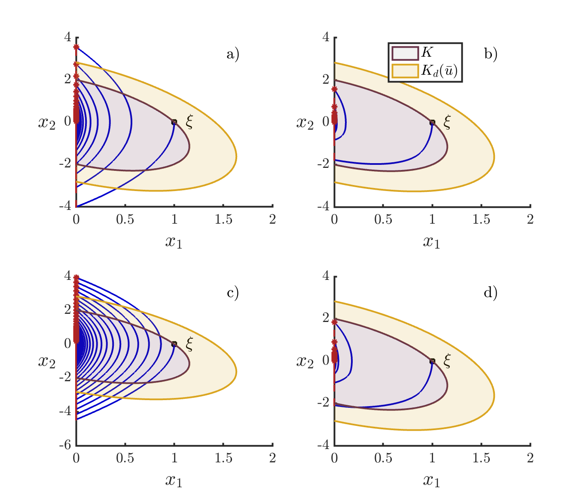
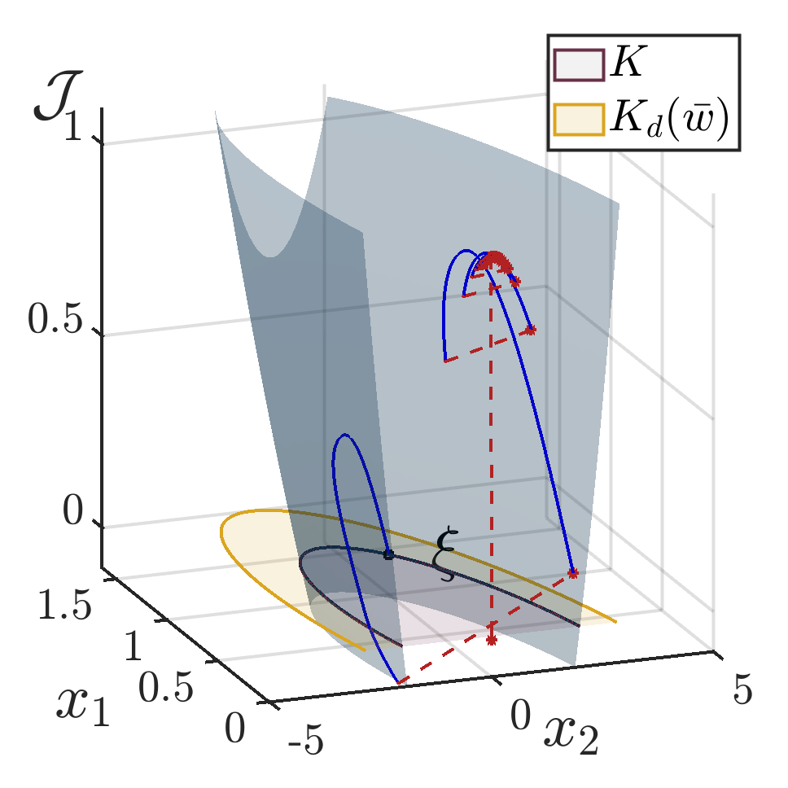

# Inverse-Optimal Safety Control for Hybrid Systems 

Simulation for examples in HSCC'25 paper: Inverse-Optimal Safety Control for Hybrid Systems 

Author: Carlos A. Montenegro G. and Santiago Jimenez
Revision: 0.0.0.3 Date: 01/29/2025
https://github.com/camonten/InverseOptimal_HybridGames

----------------------------------------------------------------------------
# `Structure of the project`

The project is structured as follows:

```
.
├── BouncingBall.m
├── ControlBarrierFunction.m
├── PhasePortraits.m
├── CostEvaluation.m
├── README.md
└── Figures.py
```

Files description:

- `BouncingBall.m`: HybridSystem subclass defining the flow set, flow map, jump set, and jump map of the one-degree-of-freedom juggling system.
- `ControlBarrierFunction.m`: Class defining ISS-CBFs for Hybrid Systems
- `PhasePortraits.m`: Code necessary to reproduce Fig. 1. in the paper.
- `CostEvaluation.m`: Code necessary to reproduce Fig. 2. in the paper.


# `Installation`

Prerequisites:
- `Matlab` (Developed in R2022b). Install HyEQ Toolbox 3.0.0.76, available [at this link](https://www.mathworks.com/matlabcentral/fileexchange/41372-hybrid-equations-toolbox).

`IMPORTANT`: The code will not run if the HyEQ Toolbox is not previously installed.

# `Running the files`

Having successfully installed the HyEQ Toolbox:
1. Clone the repository.
```bash
git clone https://github.com/camonten/InverseOptimal_HybridGames.git
```
2. Open Matlab and make sure your `Current Folder` is this repository you just cloned.
3. To reproduce `Fig. 1` in the paper you should run `PhasePortraits.m`. The result should be the following:


4. To reproduce `Fig. 2` in the paper you should run `CostEvaluation.m`. The result should be the following:


----------------------------------------------------------------------------
# `Reuse Instruction`

If you would like to implement a different CBF, below are detailed descriptions for each function defined in the file `ControlBarrierFunction.m`:

## Constructor: `ControlBarrierFunction()`

- **Purpose:**  
  Initializes an instance of the `ControlBarrierFunction` class.
---

## Method: `B(x)`

- **Purpose:**  
  Computes the barrier function value for a given state vector `x`.

- **Parameters:**  
  - `x`: A state vector.
---

## Method: `gradB(x)`

- **Purpose:**  
  Calculates the gradient of the barrier function with respect to the state vector `x`.

- **Parameters:**  
  - `x`: A state vector.
---

## Method: `polar_boundary_nbhd(which)`

- **Purpose:**  
  Generates the coordinates for the boundary of the barrier's neighborhood. This function is useful for plotting the boundary.

- **Parameters:**  
  - `which`: A string that determines the scaling factor. If set to `"Kd"`, the neighborhood boundary will be adjusted by the disturbance parameter `rho_bar_u`; otherwise, it defaults to the standard boundary.
---

## Method: `plot()`

- **Purpose:**  
  Provides a complete visualization of the control barrier function, including:
  - The boundary of the 0-superlevel set.
  - A filled patch representing the 0-sublevel set.
  - The neighborhood around the barrier boundary.
---

To simulate a different hybrid system, we refer the user to [this link](https://hyeq.github.io/matlab/creating-and-simulating-hybrid-systems) where they can find the documentation and examples of the [HyEQ Toolbox](https://www.mathworks.com/matlabcentral/fileexchange/41372-hybrid-equations-toolbox).